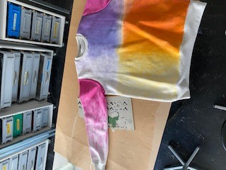
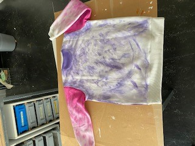

+++
title = "Freigestalterische Arbeit Joao"
date = "2022-05-16"
draft = true
pinned = false
tags = []
image = "bild4.jpg"
description = "In diesem Blog geht es um meine freigestalterische Arbeit im Fach BG. Ich habe einen Pullover angemalt. Als Inspiration hatte ich verschiedene abstrakte Kunstwerke. Die Materialien, welche ich verwendet habe sind: Ein Pullover, verschiedene Pinsel, Textilfarbe und Wasser."
footnotes = "Joao"
+++

   

   

   

   Jetzt kommt noch der Teil mit der OneLineArt.